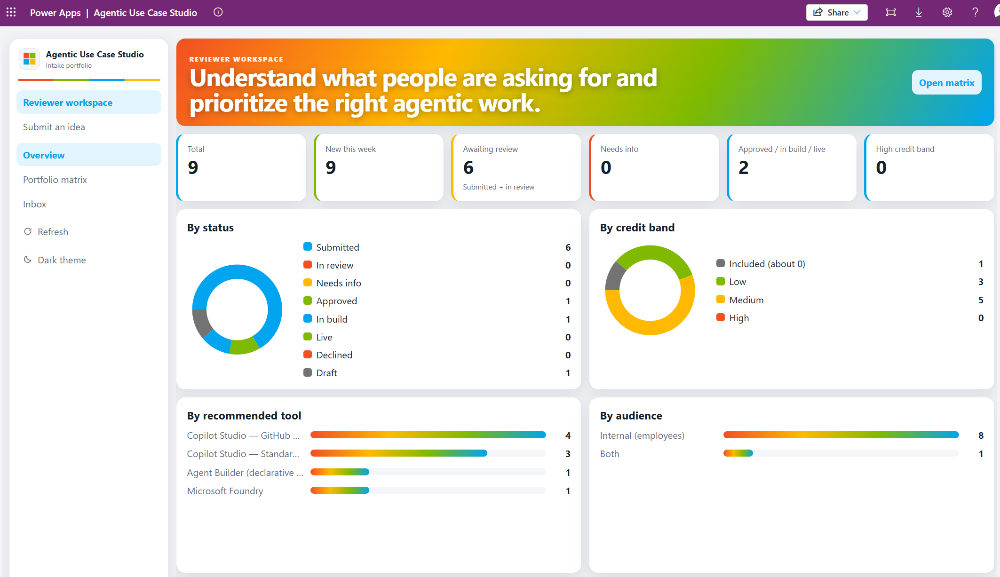

# Agentic Use Case Intake

> [!CAUTION]
> **Disclaimer**
>
> This accelerator is provided **"as is"**, without warranty of any kind. It is a personal sample,
> **not an official Microsoft product**, and is not supported by Microsoft Support.
>
> **Neither Microsoft nor the author is responsible** for how this tool is used or for any impact it
> has on your environment, including but not limited to:
>
> - **Data**: records created by the intake agent and the apps, and anything the agent does through
>   the Dataverse MCP server with the signed-in user's permissions
> - **Copilot Credit consumption**: the intake agent runs on the Copilot Studio **GitHub Copilot
>   harness**, which consumes Copilot Credits
> - **Database capacity**: Dataverse storage used by use cases, target systems and conversation summaries
> - **Recommendations**: tool recommendations and credit bands are **indicative planning estimates,
>   not quotes, licensing advice or commitments**
>
> Review and test it in a non-production environment before any wider use, and set a credit cap on the
> agent. There is **no guarantee of updates, bug fixes or ongoing maintenance.**

A Power Platform accelerator for collecting and triaging **agentic use case ideas**. Anyone can describe
an idea for an AI agent to a conversational intake assistant in plain language. The assistant
recommends the Microsoft tool best suited to build it and estimates a Copilot Credit consumption band.
It then saves the idea to Microsoft Dataverse, where a Center of Excellence (CoE) can review and
prioritize the pipeline.

It is built as a demonstration accelerator for sharing with customers, so the architecture is
deliberately small, portable and easy to read.



---

## What it does

1. **Describe**: a submitter, usually not technical, chats with the **Agentic Use Case Intake** agent in
   Teams or Microsoft 365 Copilot. They describe the idea in a few sentences, then answer only the
   missing questions, one at a time, with short options. "Not sure" is always accepted. The target is
   6–8 questions and under 5 minutes.
2. **Assess**: the agent plays back a summary and applies two rubrics:
   - **Tool selection** recommends one of Microsoft 365 Copilot, Copilot Cowork, Agent Builder,
     Copilot Studio (Standard harness), Copilot Studio (GitHub Copilot harness), Microsoft Foundry, or
     *no agent needed (Power Automate)*, with an alternative and a plain-language rationale.
   - **Credit estimation** gives users × conversations × credits per conversation, adjusts for
     Microsoft 365 Copilot licences, and maps the result to a band: **Included · Low · Medium · High**.
     It also scores complexity, confidence, value, feasibility and priority.
3. **Submit**: once the user confirms, the agent saves the use case and its target systems to Dataverse
   through the **Dataverse MCP server**. It follows a Dataverse **business skill** that defines exactly
   how to write the records, then replies with an ID such as `AUC-01042`.
4. **Review**: the CoE works the pipeline in the **Agentic Use Case Studio** code app, which has a
   dashboard, a value × feasibility matrix, an inbox and review actions. Back-office work happens in
   the **Agentic Use Case Hub** model-driven app.

Every use case moves through one lifecycle:

```
Submitted → In review → Approved → In build → Live
              ↘ Needs info (reviewer asks a question)   ↘ Declined
```

Submitters can ask the agent "What's the status of AUC-01042?" or "Show my ideas" at any time, or
open **My submissions** in the Studio app.

## What's in the box

| Piece | Description |
| --- | --- |
| **Dataverse** | `Agentic Use Case` (`sams_usecase`) and `Target System` (`sams_usecasesystem`) tables, 17 global choices, auto-numbered IDs (`AUC-#####`) |
| **Security roles** | *Agentic Use Case Submitter* (create and read own) · *Reviewer* (read and update all) · *Admin* (full) |
| **Business skills** | *Submit agentic use case* (with a generated `choice-values.md` resource) and *Look up my agentic use cases*: Dataverse business skills the agent discovers and follows through the Dataverse MCP server |
| **Copilot Studio agent** | *Agentic Use Case Intake*, on the GitHub Copilot harness with Entra ID sign-in. It has two skills (intake interview, assessment), a plain-language glossary as knowledge, and two tools: **Dataverse MCP Server** and Office 365 Users **Get my profile (V2)** |
| **Code app** | *Agentic Use Case Studio* (React + TypeScript), **included in the solution**. It has a Reviewer workspace and a Submit an idea area |
| **Model-driven app** | *Agentic Use Case Hub*, the back office: forms, 8 views, 6 charts and the *Agentic Use Case Overview* dashboard |
| **Environment variables** | `sams_IntakeAgentUrl`, `sams_ToolGuideUrl`, `sams_CreditsGuideUrl` |
| **Connection references** | Dataverse (for the MCP server tool) and Office 365 Users |

### The intake agent

The agent follows the architecture recommended for the GitHub Copilot harness:

- **Instructions** hold global rules: scope, tone, confirmation before saving, and "only show users
  their own ideas".
- **Skills** hold the procedures: the interview and the assessment rubrics.
- **Knowledge** holds reference facts: a glossary that explains each tool in plain language.
- **Tools** do the work: Dataverse MCP and the user's profile.

Writing to Dataverse isn't hard-coded in a flow. The agent opens the **business skill** stored in
Dataverse and follows it, so the write contract can be changed in the maker portal without
republishing the agent. Other agents can also reuse it.

The tool and credit rubrics are derived from two public guides: *Which agentic tool should I use?*
and *What consumes Copilot Credits?*.

### The code app

A full-height app shell in the Microsoft brand palette, with light and dark themes.

- **Reviewer workspace**
  - *Overview*: KPIs, status and credit-band donuts, tool and audience breakdowns, top target
    systems, a 12-week submission trend, and the newest ideas.
  - *Portfolio matrix*: value vs. feasibility bubbles, coloured by credit band.
  - *Inbox*: a searchable, filterable list of every idea.
  - *Detail*: the idea, its profile and the recommendation card, plus a review panel with status,
    final tool, reviewer notes and "information needed".
- **Submit an idea**
  - A button that opens the intake assistant.
  - *My submissions*, with a read-only detail view that highlights any questions from reviewers.

### The model-driven app

*Agentic Use Case Hub* is the administration surface. It has full forms with Idea, Profile,
Recommendation, Review, Target systems and Conversation tabs, and views such as *New Submissions*,
*Awaiting Review*, *Needs Info*, *Approved Portfolio*, *High Credit Band* and *External Facing*. Its
dashboard charts the pipeline by status, tool, credit band, audience, week and target system.

## Repository layout

```
packages/           Managed and unmanaged solution zips + deployment settings template
solution/           Unpacked Dataverse solution source (tables, apps, agent, skills, code app bundle)
code-app/           React + TypeScript + Vite source for the Agentic Use Case Studio code app
agent/              Copilot Studio agent source (GitHub Copilot harness YAML, pac copilot push/pull)
skills/             Source of the two Dataverse business skills (SKILL.md + resources)
rubric/             Source of truth for the tool-selection and credit rubrics, interview and glossary
evals/              Single-turn test set for the Copilot Studio Evaluate tab + end-to-end personas
scripts/            Python/PowerShell scripts that built the solution, and deploy.ps1
screenshots/        Screenshots used in this README
```

## Getting started

### Prerequisites

- A Power Platform environment with Dataverse, and the System Administrator role to import
- **Copilot Studio** with capacity for agents on the **GitHub Copilot harness** (usage-based Copilot Credits)
- The **Dataverse MCP server** allowed for Copilot Studio (on by default) and **business skills (preview)** enabled
- Power Apps **code apps** enabled in the environment
- [Power Platform CLI](https://aka.ms/pac/install) if you import from the command line

### Import the solution

Grab the zips from the [latest release](../../releases/latest) or `packages/`:

```powershell
pac auth create --name target --environment https://<your-env>.crm.dynamics.com/
pac solution import --path AgenticUseCaseIntake_managed.zip --activate-plugins
pac solution publish
```

Use the unmanaged package (`AgenticUseCaseIntake.zip`) for a development environment. To bind the
connection references during import, copy `packages/deploymentSettings.example.json` to
`deploymentSettings.json`, fill in your connection IDs, and run:

```powershell
.\scripts\deploy.ps1 -EnvironmentUrl https://<your-env>.crm.dynamics.com -SettingsFile .\packages\deploymentSettings.json
```

**The code app is part of the solution.** Once the import finishes, *Agentic Use Case Studio* appears
under **Apps** in make.powerapps.com, ready to open. There's nothing to install or build. Its source
is in `code-app/` only for reference and customization.

### After importing

1. **Assign the security roles** together with *Basic User*:
   - *Agentic Use Case Submitter* to everyone who can submit ideas.
   - *Agentic Use Case Reviewer* to the CoE and managers.
   - *Agentic Use Case Admin* to app owners.
2. **Connect and publish the agent.**
   1. Open **Agentic Use Case Intake** in Copilot Studio.
   2. Check that both tools (*Dataverse MCP Server*, *Get my profile (V2)*) have a connection.
   3. **Publish** it, then add it to **Teams and Microsoft 365 Copilot** under *Channels*.
   4. Share it with your submitters.
3. **Share the apps.** Share *Agentic Use Case Studio* and *Agentic Use Case Hub* with submitters and reviewers.
4. **Set a credit cap.** In the Power Platform admin center, allocate and cap Copilot Credits for the
   agent. It's listed under the **GitHub Copilot** harness.
5. *(Optional)* **Link the Studio app to the agent.** The *Open intake assistant* button reads
   `sams_IntakeAgentUrl`, and that value is included in the app **when it's built**. Until you rebuild
   it, the button shows a notice asking an admin to set the link, and users open the agent from Teams.
   To wire the button up, set the variable to the agent's Teams link and redeploy the code app from
   source (see [`code-app/README.md`](code-app/README.md)).

## Using it

**As a submitter**
- **Start**: open *Agentic Use Case Intake* in Teams or Microsoft 365 Copilot and say *"I have an
  idea for an agent"*.
- **Answer**: reply in your own words. Choose "Not sure" whenever you don't know.
- **Confirm**: check the summary and the recommendation, then say *yes* to submit.
- **Follow up**: ask *"What's the status of AUC-01042?"*, or open **My submissions** in the Studio app.

**As a reviewer**
- **Triage**: open *Agentic Use Case Studio*, then work through the **Inbox**, filtering by status,
  tool, credit band and audience.
- **Review**: open an idea to see the rationale, credit drivers, assumptions and target systems.
- **Decide**: set the status, record the **final tool** when it differs from the agent's
  recommendation, and ask for information when needed.
- **Prioritize**: use the **Overview** and the **Portfolio matrix**.

## Customizing

| To change | Edit | Then |
| --- | --- | --- |
| Tool selection or credit rules, interview questions, glossary | `rubric/*.md` | `python scripts/build_agent.py`, then `pac copilot push` from `agent/intake-agent` and publish the agent |
| How use cases are saved or looked up | `skills/*/SKILL.md` | `python scripts/sync_skills.py` (no agent republish needed) |
| Credit band thresholds | `rubric/credit-estimation.md` | as for the rubrics |
| The code app | `code-app/src` | see [`code-app/README.md`](code-app/README.md) |

The scripts read `DATAVERSE_URL` and `TENANT_ID` from a `.env` file (see `.env.example`), sign in once
with a device code, and reuse the cached token. `scripts/schema_def.py` is the single definition of the
tables and choices, and `scripts/create_schema.py`, `create_roles.py` and `create_mda.py` rebuild the
Dataverse side idempotently.

## Testing

- **Evaluate tab**: import [`evals/intake-agent-single-turn.csv`](evals/intake-agent-single-turn.csv) in
  Copilot Studio → agent → **Evaluate** → *New evaluation* → *Single response*.
- **End to end**: run the 12 personas in [`evals/intake-agent-personas.md`](evals/intake-agent-personas.md).
  They cover an HR FAQ, an IT help desk, invoice exceptions, a public website bot, a pure workflow, a
  SaaS product, a vague idea and guardrail cases. Include a run as a **Submitter-only** test user,
  because System Administrators bypass the role boundary.

## Notes and limitations

- **This harness charges for every turn.** Agents on the GitHub Copilot harness consume Copilot
  Credits for build, test, evaluation and every conversation, for licensed and unlicensed users alike.
  A structured interview on its own would fit the Standard harness; this harness is used for the
  reasoning and recommendation step. Cap the agent.
- **Security relies on the Submitter role.** The GitHub Copilot harness exposes every tool of an MCP
  server to the agent. The agent calls Dataverse **as the signed-in user**, so the *Submitter* role is
  the real boundary: users can only create and read their own use cases.
- **Business skills are in preview.** If they're not available in your environment, copy
  `skills/*/SKILL.md` into the agent as inline skills (`behaviors/`) and remove the "open the business
  skill" step from its instructions.
- **"My submissions" matches on the sign-in address (UPN).** The agent saves the address it gets from
  *Get my profile (V2)*. Ideas submitted under a different email typed into the chat won't show there,
  but reviewers still see them.
- **The intake agent link is set at build time.** Code apps can't read environment variables at
  runtime here, so see *After importing*, step 5.
- **Quick find** on use cases searches the title only.
- **Recommendations are indicative.** The CoE records the final decision in *Final Tool*, and
  *Rubric Version* records which rubric produced each assessment.

Out of scope by design: building the recommended agent, pricing quotes, approval workflows,
notifications, and duplicate-idea detection. The data model leaves room for them later.

## License

[MIT](LICENSE). Provided as is: see the [disclaimer](#agentic-use-case-intake) at the top of this page.
